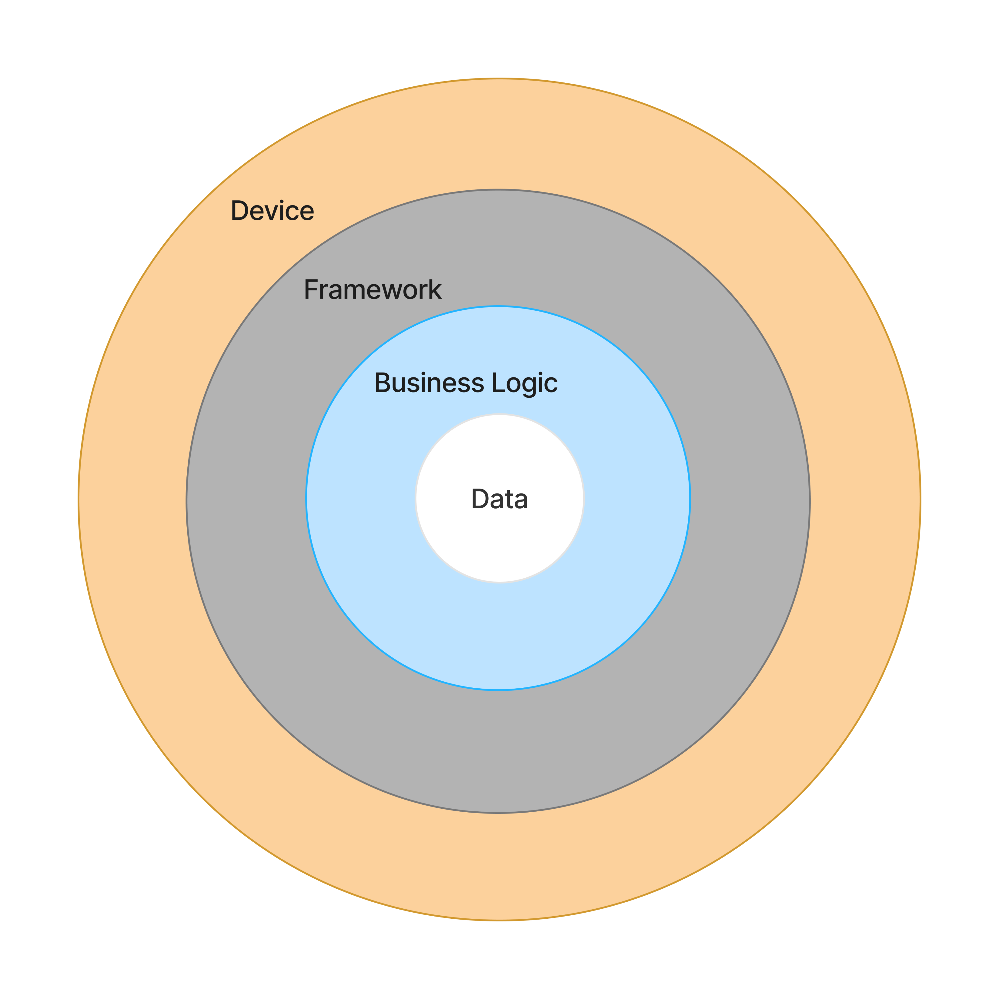

# Nucleus Core

[](https://rubygems.org/gems/nucleus-core)
[](https://app.circleci.com/pipelines/github/dodgerogers/nucleus-core-ruby?branch=main)
[](https://codeclimate.com/github/dodgerogers/nucleus-core)

- [Overview](#overview)
- [Components](#components)
- [Getting Started](#getting-started)
- [Implementing Business Logic](#implementing-business-logic)
- [Supported Frameworks](#supported-frameworks)
- [Support](#support)
- [License](#license)
- [Code of conduct](#code-of-conduct)
- [Contribution guide](#contribution-guide)

## Overview

I once saw this diagram which showed how business logic "should" be separated from the framework. It seemed a simple enough concept but difficult to execute.\



Nucleus-Core is a framework to translate this in code. Prescribing that the framework handles requests and rendering responses, and business logic is everything else in-between.

## Components

**NucleusCore::Responder** - The boundary which passes request parameters to your business logic, then renders a response.\
**NucleusCore::Policy** - Authorization objects.\
**NucleusCore::Operation** - Service implementation, executes a single use case and can rollback any side effects.\
**NucleusCore::Workflow** - Sequenced service orchestration.\
**NucleusCore::Repository** - Data access, conceals data source interaction, and returns objects the application owns.\
**NucleusCore::View** - Presentation objects, capable of rendering multiple formats.

## Supported Frameworks

- [nucleus-rails](https://rubygems.org/gems/nucleus-rails)

## Getting started with an unsupported framework

1. Install the gem

```ruby
gem install 'nucleus-core'
```

2. Initialize and configure

```ruby
require "nucleus-core"

NucleusCore.configure do |config|
  config.logger = Logger.new($stdout)
  config.workflow_process_repository = WorkflowProcessRepository
  config.workflow_process_save_method = :save!
  config.default_response_format = :json
  config.request_exceptions = {
    not_found: RecordNotFound,
    unprocessible: [RecordInvalid, RecordNotSaved],
    bad_request: ArgumentError,
    forbidden: AuthorizationException,
    unauthorized: AuthenticationException
  }
end
```

3. Create a `request adapter` which specifies request paramaters to pass to your business logic.

```ruby
class RequestAdapter
  def self.call(args={})
    {
      format: args[:format], # required
      parameters: args[:params],
      cookies: args[:cookies],
      key: 'value'
    }
  end
end
```

4. Create a `response adapter` to handle rendering.

```ruby
class ResponseAdapter
  # entity: NucleusCore::View::Response
  
  def self.json(entity)
  end

  def self.xml(entity)
  end

  def self.html(entity)
  end

  def self.pdf(entity)
  end

  def self.csv(entity)
  end

  def self.text(entity)
  end

  def self.nothing(entity)
  end

  def self.set_header(key, value)
  end
end
```

5. Define views and their formats.

```ruby
class OrderView < NucleusCore::View
  def initialize(order, process)
    attributes = {}.tap do |attrs|
      attrs[:id] = order.id
      attrs[:price] = "$#{order.total}"
      attrs[:paid] = order.paid
      attrs[:created_at] = order.created_at
      attrs[:state] = process.state
    end

    super(attributes)
  end

  # Default implementation
  def json_response
    NucleusCore::View::Response.new(format: :json, content: to_h)
  end

  def csv_response
    NucleusCore::View::Response.new(format: :csv, content: generat_csv(self))
  end

  def pdf_response
    NucleusCore::View::Response.new(format: :pdf, content: generat_pdf(self))
  end
end
```

6. Then put it altogether.

```ruby
class OrdersEndpoint
  def initialize
    @responder = Nucleus::Responder.new(
      response_adapter: ResponseAdapter,
      request_adapter: RequestAdapter
    )
    @request = {
      format: request.format,
      parameters: request.params,
      cookies: request.cookies
    }
  end

  def create
    @responder.execute(@request) do |req|
      policy = OrderPolicy.new(req.user, req.order_id)

      policy.enforce!(:can_fulfill?)

      manager = FulfillOrder.call(id: req.order_id, user: req.user)
      context = manager.context

      return context if !context.success?

      return OrderView.new(order: context.order, process: manager.process)
    end
  end
end
```

We want to support as many frameworks as possible so tell us about it!

### How to Implement Business Logic

`Policies` have access to the accessing user, entity, and should return a boolean.

```ruby
class OrderPolicy < NucleusCore::Policy
  def can_fulfill?
    client.is_admin? && entity.user_id == client.id
  end
end
```

`Repositories` handle interactions with the data source. The data access library/ORM/client is not important, return an object that the application owns. Repositories return `NucleusCore::Repository::Result` objects which have `entity`, and `exception` properties.

```ruby
class OrderRepository < NucleusCore::Repository
  def self.find(id)
    execute do |result|
      resp = Rest::Client.execute("https://myshop.com/orders/#{id}", :get)

      result.entity = DomainModels::Order.new(id: resp[:id])
    rescue RestClient::RequestException => e
      result.exception = e
    end
  end

  def self.destroy(id)
    execute do |result|
      Rest::Client.execute("https://myshop.com/orders/#{id}", :delete)
    rescue RestClient::CustomException => e
      result.exception = e
    end
  end
end
```

`Operations` execute a single business process, attach entities and errors to the `context`, and rolls back side effects on failure. They implement two instance methods - `call` and `rollback` which are passed either a `Hash` or `Nucleus::Operation::Context` object, and are called via their class method namesakes (e.g. `FetchOrder.call(args)`, `FetchOrder.rollback(context)`).

```ruby
class FetchOrder < NucleusCore::Operation
  def call
    validate_required_args!() do |missing|
      missing.push('user_name') if context.user.name.blank?
    end

    formatted_id = "#{context.user.id}-#{context.order_id}"
    result = OrderRepository.find(formatted_id)

    if result.exception
      message = "Couldn't find order with ID #{formatted_id}"
      context.fail!(message, exception: result.exception)
    end

    order = result.entity

    log_order_was_accessed(order)

    context.order = order
  rescue NucleusCore::BaseException => e
    context.fail!(e.message, exception: e)
  end

  def required_args
    [:id, :user].freeze
  end

  def rollback
    delete_order_access_log(context.order) if context.order
  end
end
```

`Worklflows` define multi-step proceedures, are composed of operations or lambas/procs, and return a workflow manager object.

```ruby
class FulfillOrder < NucleusCore::Workflow
  def define
    start_node(continue: :apply_discount?)
    add_node(
      state: :apply_discount?,
      operation: FetchOrder,
      determine_signal: ->(context) { context.order.total > 10 ? :discount : :pay },
      signals: { discount: :discount_order, pay: :take_payment }
    )
    add_node(
      state: :discount_order,
      operation: ->(context) { context.discounted = context.order.discount! },
      signals: { continue: :take_payment }
    )
    add_node(
      state: :take_payment,
      operation: ProcessOrderPayment,
      signals: { continue: :completed }
    )
    add_node(
      state: :completed,
      determine_signal: ->(_) { :wait }
    )
  end
end
```

---

## Support

If you want to report a bug, or have ideas, feedback or questions about the gem, [let me know via GitHub issues](https://github.com/dodgerogers/nucleus_core/issues/new) and we will do our best to provide a helpful answer.

## License

The gem is available as open source under the terms of the [MIT License](LICENSE.txt).

## Code of conduct

Everyone interacting in this project’s codebases, issue trackers, chat rooms and mailing lists is expected to follow the [code of conduct](CODE_OF_CONDUCT.md).

## Contribution guide

Pull requests are welcome!
